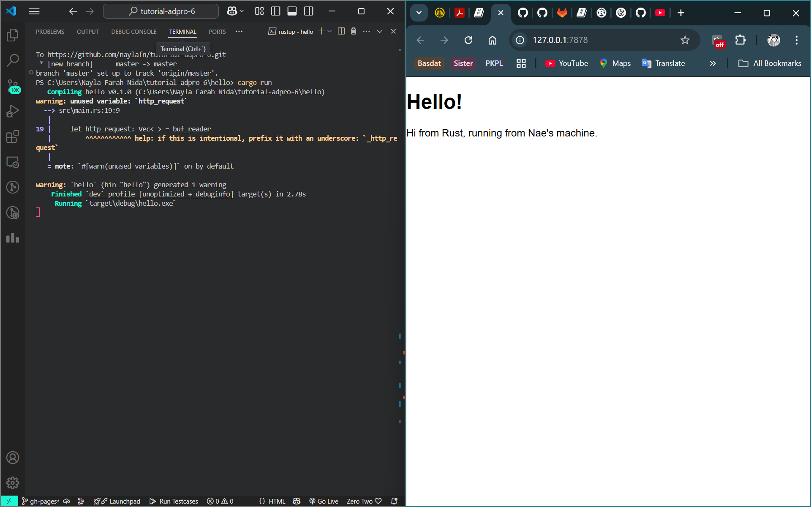
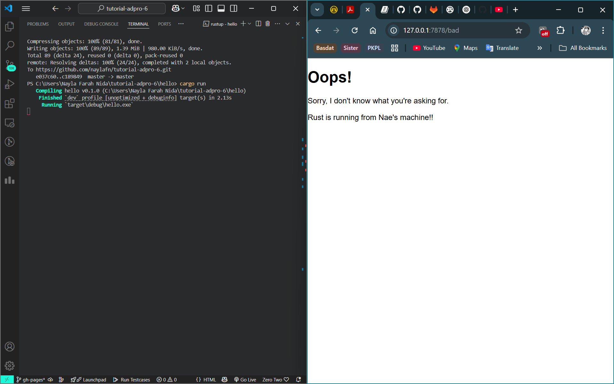

# Tutorial Pemrograman Lanjut
## Nayla Farah Nida - 2306213426

### Module 6

<details>
<summary>Reflection: Commit 1</summary>

The `handle_connection` method reads and prints the HTTP request headers from a TCP connection.

**1. Wraps the TCPStream in BufReader**  
`BufReader::new(&stream)`: Creates a buffered reader to efficiently read lines from the connection.

**2. Reads the HTTP request line by line**  
`.lines()`: Reads the incoming data line by line.  
`.map(|result| result.unwrap())`: Extracts the actual string from the Result<String, io::Error>, if no errors occur.  
`.take_while(|line| !line.is_empty())`: Reads lines until it encounters an empty line (`""`).  

**3. Stores the request in a `Vec<String>`**  

**4. Prints the HTTP request**  

Output:

```rust
Request: [
    "GET / HTTP/1.1",
    "Host: 127.0.0.1:7878",
    "Connection: keep-alive",
    "Cache-Control: max-age=0",
    "sec-ch-ua: \"Chromium\";v=\"134\", \"Not:A-Brand\";v=\"24\", \"Google Chrome\";v=\"134\"",
    "sec-ch-ua-mobile: ?0",
    "sec-ch-ua-platform: \"Windows\"",
    "Upgrade-Insecure-Requests: 1",
    "User-Agent: Mozilla/5.0 (Windows NT 10.0; Win64; x64) AppleWebKit/537.36 (KHTML, like Gecko) Chrome/134.0.0.0 Safari/537.36",
    "Accept: text/html,application/xhtml+xml,application/xml;q=0.9,image/avif,image/webp,image/apng,*/*;q=0.8,application/signed-exchange;v=b3;q=0.7",
    "Sec-Fetch-Site: cross-site",
    "Sec-Fetch-Mode: navigate",
    "Sec-Fetch-User: ?1",
    "Sec-Fetch-Dest: document",
    "Accept-Encoding: gzip, deflate, br, zstd",
    "Accept-Language: en-US,en;q=0.9,id-ID;q=0.8,id;q=0.7,ms;q=0.6,it;q=0.5",
    "Cookie: csrftoken=qnUz3g0Vm17XcQEPWpnPXAZkf20LmLbS",
]
```
</details>

<details>
<summary>Reflection: Commit 2</summary>



First, it creates a `BufReader` to read the request line by line and stores the lines in a slice until it sees an empty line, which is the marker for the end of the HTTP request headers. Once it has read the request, it constructs a response with a `200 OK` status and opens `hello.html` from the filesystem. It then creates the response in the correct HTTP format, including the `Content-Length` header and then the file contents. Finally, it sends the response back to the client using `stream.write_all()`, so the browser can display the `hello.html` page. This ensures that any client requesting the server receives my messages in `hello.html`.
</details>

<details>
<summary>Reflection: Commit 3</summary>



`handle_connection` reads the first line of the HTTP request to determine the requested resource. If the request is `GET / HTTP/1.1`, it responds with the contents of `hello.html` and a `200 OK` status. Otherwise, it serves `404.html` with a `404 NOT FOUND` status. There are some refactorings done to fix the obvious code duplication. I achieved that by using the `match` expression to efficiently map each request path to the appropriate status code, eliminating redundant conditional checks.
</details>

<details>
<summary>Reflection: Commit 4</summary>

If the request is for `GET / HTTP/1.1`, it responds with `hello.html` and a `200 OK` status, while an unknown request results in a `404 NOT FOUND` response with `404.html`. If the request is for `GET /sleep HTTP/1.1`, the server will have a 5-second delay before sending `hello.html`. For example, if someone requests `GET /sleep HTTP/1.1`, and then a second later another person tries requesting `GET / HTTP/1.1`, the other person will need to wait 4 seconds to access `hello.html`. Because the server processes requests sequentially (single-threaded), any request that arrives while another is sleeping will have to wait until the first request is completed, making the server slow for multiple users.
</details>

<details>
<summary>Reflection: Commit 5</summary>

In the book, we are taught to improve throughput with `ThreadPool`. A thread pool is like a group of threads that are ready to handle tasks, allowing us to process connections concurrently. We could spawn an unlimited number of threads, but that increases the risk of DoS (Denial of Service) attacks, which is why we limit the number of threads in this tutorial. We define the `ThreadPool` as a `struct` that has `workers` and a `sender`. `workers` is a vector, each running in a loop and waiting for tasks that will be delivered by `sender`. We use a channel (`mpsc::Sender<Job>`) for sending tasks from the main thread to `worker` threads. Each `worker` continuously waits for jobs, executes them when available, and logs its activity. If the channel is closed, `workers` detect it, log a shutdown message, and terminate gracefully.
</details>

